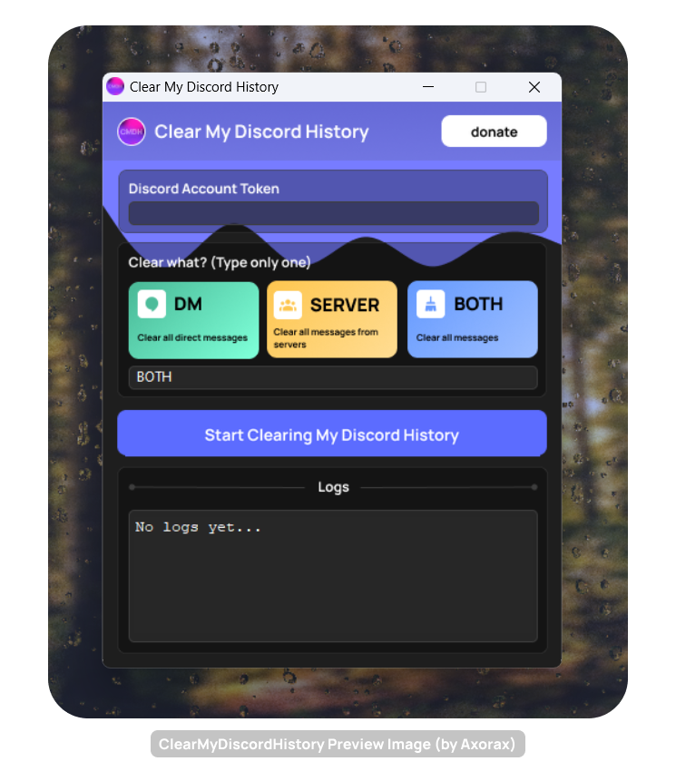

ClearMyDiscordHistory

## About

ClearMyDiscordHistory is an application that can clear your DM or server history on Discord as the name implies. It deletes all of the messages that you have sent. A preview of the app is shown below:

> [!NOTE]
> **After you click the start button, the app might stop responding. This is normal, it takes a long time to get the messages in order to delete them.**
>
> You can see the output in the console if you want to get feedback. If you don't want any feedback, use the noconsole version of the app.
>
> After starting the clearing process, you can type "cmdh" on any channel in Discord and it should respond that it is working.
>
> The application will close by itself after it is done.

## Warning (Read me)

ClearMyDiscordHistory is not responsible if any damages occur by using the application. By running the application, you willingly take responsibility for any damages that may occur or happen. ClearMyDiscordHistory is considered as a self-bot and self-bots are against Discord's ToS. Therefore, there is a risk of Discord taking actions against your account.

## License

This project is licensed under the Creative Commons Attribution-NonCommercial 4.0 International License - see the [LICENSE](LICENSE.txt) file for details or go to https://creativecommons.org/licenses/by-nc/4.0/.

---

<a href="https://www.patreon.com/axorax">Support me on Patreon</a> — <a href="https://github.com/axorax/socials">Check out my socials</a>
